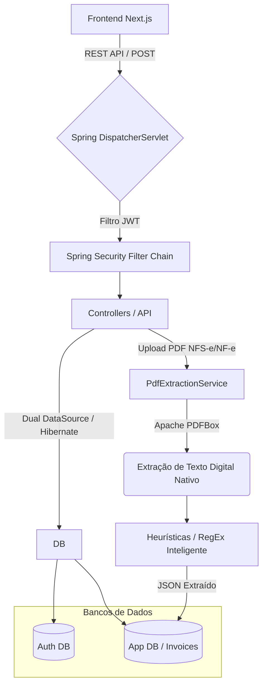
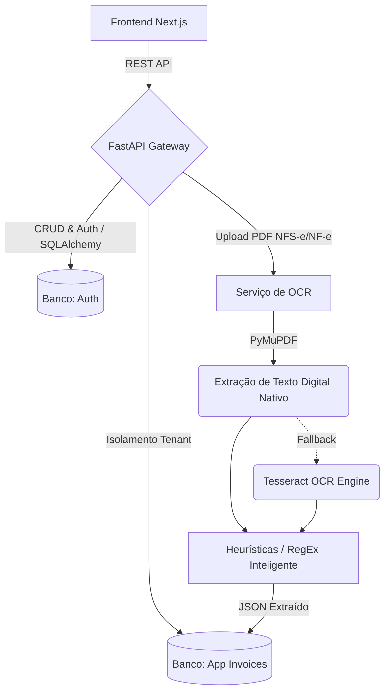

# NFSe SaaS Platform (OCR & Multitenant Edition)

Este repositório contém o código-fonte de uma plataforma SaaS desenvolvida para a captura automatizada, armazenamento, gestão e integração de documentos fiscais eletrônicos (NF-e, NFS-e e CT-e), com foco central na leitura estruturada de PDFs via OCR.

## 1. Visão Geral

O **NFSe SaaS Platform** atua como um sistema centralizador e gerenciador de notas fiscais emitidas contra CNPJs cadastrados no sistema, operando em um ecossistema multitenant.

### Objetivos do Projeto
1. **Captura Automatizada:** Integração com prefeituras e SEFAZ para coleta de notas fiscais.
2. **Leitura OCR / Extração de Texto:** Extração de dados cruciais (CNPJ, Valor, etc.) de PDFs de notas fiscais de serviço (NFS-e) de prefeituras sem webservice aberto.
3. **Arquitetura Multitenant (SaaS):** Isolamento total de dados entre diferentes empresas/clientes no mesmo banco de dados.
4. **Integração ERP:** API RESTful robusta para alimentação de sistemas contábeis parceiros.

## 2. Ciclo de Desenvolvimento (Fases)

1. **Fase 1 (Python First) - CONCLUÍDA:** Validação da arquitetura multitenant e da extração OCR complexa utilizando o ecossistema Python (FastAPI + Pytesseract).
2. **Fase 2 (Portabilidade Java) - CONCLUÍDA:** Reconstrução exata do contrato de API utilizando Java 21 e Spring Boot, comprovando proficiência técnica em múltiplas linguagens corporativas e extração nativa via Apache PDFBox.

## 3. Tecnologias e Ferramentas (Stack)

* **Frontend (Next.js 14 / React):** Interface de usuário com painel de controle SaaS, utilizando TypeScript e Tailwind CSS v4.
* **Backend A (Python 3.12 / FastAPI):** Construção rápida e ideal para integração com bibliotecas nativas de manipulação de PDF e OCR (`PyMuPDF`, `pytesseract`).
* **Backend B (Java 21 / Spring Boot 3):** Reconstrução do backend para alta escalabilidade e tipagem forte em ambiente enterprise. Utiliza `Apache PDFBox`.
* **Banco de Dados:** Padrão Microserviços (Auth DB e App DB) utilizando SQLite/PostgreSQL, mapeados via SQLAlchemy (Python) e Hibernate/JPA (Java).

## 4. Estrutura do Projeto

```text
NFSe/
├── frontend/             # Aplicação Next.js (Dashboard, UI SaaS Dark/Light mode)
├── backend-python/       # API Core e Worker de OCR em Python
├── backend-java/         # API Core em Java Spring Boot (Fase 2)
├── uploads/              # Diretório raiz para armazenamento de PDFs (Compartilhado)
├── auth.db               # Banco de dados central de Autenticação (Compartilhado)
└── nfse.db               # Banco de dados de Notas Fiscais (Compartilhado)
```

## 5. Arquitetura do Backend

A plataforma foi desenhada para ser executada perfeitamente com qualquer um dos Backends (Python ou Java).

### 5.1. Arquitetura Java (Fase 2 - Atual)

A implementação em Java substitui dependências nativas de OCR por bibliotecas Java (`Apache PDFBox`), facilitando o deploy e evitando quebras de ambiente no Windows/Linux. Além disso, introduz o robusto `Spring Security` para a barreira do JWT.



### 5.2. Arquitetura Python (Fase 1)



## 6. Execução e Variáveis de Ambiente

O projeto agora suporta troca de banco de dados (Ex: SQLite para PostgreSQL) e porta da API através do uso de variáveis de ambiente (`.env`).

### Variáveis de Ambiente Necessárias
1. **Frontend (`frontend/.env.local`):**
   - `NEXT_PUBLIC_API_URL`: Rota da API (ex: `http://localhost:8080/api/v1` para Java ou `http://localhost:8000/api/v1` para Python).
2. **Java (`backend-java/.env`):**
   - `DB_AUTH_URL` e `DB_APP_URL`
   - `JWT_SECRET` e `UPLOAD_DIR`
3. **Python (`backend-python/.env`):**
   - `AUTH_DATABASE_URL` e `APP_DATABASE_URL`
   - `SECRET_KEY`

### Passo a Passo

1. **Frontend (Next.js):**
    ```bash
    cd frontend
    npm run dev
    ```
2. **Backend (Java):** 
    ```bash
    cd backend-java
    ./mvnw spring-boot:run
    ```
3. **Backend (Python - Alternativa):** 
    ```bash
    cd backend-python
    venv\Scripts\activate
    uvicorn app.main:app --host 0.0.0.0 --port 8000
    ```

## 7. Motivação e Escolhas Arquiteturais (Trade-offs)

* **Diretórios Centralizados:** O banco de dados e os uploads foram movidos para a raiz do projeto. Isso permite que tanto o Backend em Python quanto o Backend em Java leiam/escrevam exatamente no mesmo disco sem conflitos de caminho (Pathing), simulando a realidade de um Volume Compartilhado no Docker ou um S3 Bucket em Cloud.
* **Apache PDFBox no Java:** Em vez de fazer uma chamada externa (JNI) pesada para o Tesseract no Java, optou-se pela extração em memória. Como a maioria das NFS-e são geradas digitalmente, o ganho de velocidade  supera a complexidade do OCR.
* **Interoperabilidade de Contratos (Jackson SNAKE_CASE):** Para garantir que o Frontend (Next.js) consuma a API Java da mesma forma que consumia a API Python (FastAPI), foi injetada a configuração `spring.jackson.property-naming-strategy: SNAKE_CASE` no Spring Boot. Isso converte nativamente todos os DTOs e Modelos CamelCase do Java (`invoiceNumber`) para SnakeCase (`invoice_number`), impedindo quebras de tipagem no Front-end sem poluir as Entidades Java com anotações `@JsonProperty`.
* **Servidor de Arquivos Estáticos Seguros (NIO Paths):** A resolução de pastas físicas via Spring Boot no Windows é suscetível a erros de caminho (404). Foi implementado a injeção do pacote `java.nio.file.Paths` dentro da classe `WebConfig`, forçando o encapsulamento Universal de URI (`file:///...`). Isso torna a visualização e armazenamento de PDFs do sistema compatível em qualquer Sistema Operacional (Windows, Mac ou Linux Server).
* **FastAPI vs Spring Boot:** O projeto demonstra a flexibilidade de microsserviços. A camada de segurança, JWT e Banco de Dados estão rigorosamente mapeadas em ambos, permitindo que a empresa escolha a linguagem ideal para escalar.

## 8. Próximos Passos (Backlog)

* **[Fase 3] Fluxo de Contratos e Ordens de Serviço (OS):** Implementar funcionalidade de relacionamento entre Contratos, OS e Notas Fiscais, refletindo o fluxo real contábil.
* **[Fase 4] Emissor (Faturador) de NFS-e Padrão Nacional:** Evoluir a plataforma de uma ferramenta de leitura (Inbound) para um emissor fiscal (Outbound). Integração com as APIs da Receita Federal.
* **[Fase 5] Emissor de NF-e (Produto):** Implementação da emissão de notas de produto, utilizando assinaturas A1 e webservices das SEFAZ estaduais.