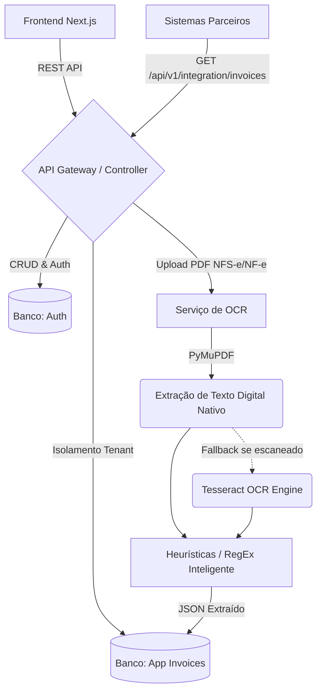

# NFSe SaaS Platform (OCR & Multitenant Edition)

Este repositório contém o código-fonte de uma plataforma SaaS desenvolvida para a captura automatizada, armazenamento, gestão e integração de documentos fiscais eletrônicos (NF-e, NFS-e e CT-e), com foco central na leitura estruturada de PDFs via OCR.

## 1. Visão Geral

O **NFSe SaaS Platform** atua como um sistema centralizador e gerenciador de notas fiscais emitidas contra CNPJs cadastrados no sistema, operando em um ecossistema multitenant.

### Objetivos do Projeto
1. **Captura Automatizada:** Integração com prefeituras e SEFAZ para coleta de notas fiscais.
2. **Leitura OCR (Optical Character Recognition):** Extração de dados cruciais (CNPJ, Valor, etc.) de PDFs de notas fiscais de serviço (NFS-e) de prefeituras sem webservice aberto.
3. **Arquitetura Multitenant (SaaS):** Isolamento total de dados entre diferentes empresas/clientes no mesmo banco de dados.
4. **Integração ERP:** API RESTful robusta para alimentação de sistemas contábeis parceiros.

## 2. Ciclo de Desenvolvimento (Fases)

1. **Fase 1 (Python First):** Validação da arquitetura multitenant e da extração OCR complexa utilizando o ecossistema Python (FastAPI + Pytesseract).
2. **Fase 2 (Portabilidade Java):** Reconstrução exata do contrato de API utilizando Java 21 e Spring Boot, comprovando proficiência técnica em múltiplas linguagens corporativas.

## 3. Tecnologias e Ferramentas (Stack)

* **Frontend (Next.js 14 / React):** Interface de usuário com painel de controle SaaS, utilizando TypeScript e Tailwind CSS v4.
* **Backend A (Python 3.12 / FastAPI):** Construção rápida e ideal para integração com bibliotecas nativas de manipulação de PDF e OCR.
* **Backend B (Java 21 / Spring Boot 3):** Reconstrução do backend para alta escalabilidade e tipagem forte em ambiente enterprise.
* **Módulo OCR:** `PyMuPDF` (extração digital direta) com fallback para `pytesseract` (notas escaneadas).
* **Banco de Dados:** Padrão Microserviços (Auth DB e App DB) utilizando SQLite/PostgreSQL via SQLAlchemy (Python).

## 4. Estrutura do Projeto

```text
NFSe/
├── frontend/             # Aplicação Next.js (Dashboard, UI SaaS Dark/Light mode)
│   ├── src/app/          # Rotas da aplicação web (Login, Register, Dashboard)
│   └── public/           # Assets
├── backend-python/       # API Core e Worker de OCR em Python
│   ├── app/              # Lógica de negócio, Rotas, Modelos e Serviços (FastAPI)
│   ├── uploads/          # Diretório local para visualização dos PDFs armazenados
│   └── requirements.txt  # Dependências Python
└── backend-java/         # (Fase 2) API Core em Java Spring Boot
```

## 5. Arquitetura do Backend



## 6. Execução

### Pré-requisitos
* **Node.js (>= 20)**
* **Python (>= 3.12)** ou **Java (>= 21)**
* **Tesseract OCR** instalado no Sistema Operacional e no PATH (apenas para fallback).
* (Opcional) **PostgreSQL** (configurado para nuvem via `.env`) ou **SQLite** nativo.

### Passo a Passo

1. **Frontend (Next.js):**
    ```bash
    cd frontend
    npm install
    npm run dev
    ```
2. **Backend (Python):** 
    ```bash
    cd backend-python
    python -m venv venv
    venv\Scripts\activate # Windows
    pip install -r requirements.txt
    uvicorn app.main:app --host 0.0.0.0 --port 8000 --reload
    ```

## 7. Funcionalidades Administrativas
- **Painel Multitenant:** Dashboard completo com modo escuro, resumo financeiro, geração de relatório PDF da tabela e botão de visualizar PDF.
- **Microserviço de Autenticação:** Separação física e lógica de usuários/tenants (AuthDB) dos dados da aplicação (AppDB).
- **Upload Híbrido:** Extração veloz de metadados como Data de Emissão, Descrição do Serviço, CNPJ e Valor Total, adaptável tanto a boletos escaneados quanto a PDFs digitais puros (DANFE).
- **Integração M2M:** API Key gerada para sistemas ERP de terceiros consumirem notas fiscais sem interação humana.

## 8. Motivação e Escolhas Arquiteturais (Trade-offs)

* **Abordagem Híbrida no OCR vs Nuvem Comercial:** Em vez de depender do AWS Textract, implementamos `PyMuPDF` para leitura instantânea de PDFs gerados digitalmente (90% dos casos reais). O OCR `Tesseract` atua apenas como *fallback* de processamento para documentos escaneados, reduzindo custos e latência computacional.
* **Bancos de Dados Separados (Microservices):** Optou-se por separar a base de autenticação (`auth.db`) da base de arquivos (`nfse.db`). Essa escolha arquitetural facilita integrações futuras, como escalar a base de notas horizontalmente mantendo um serviço único e leve para centralização de contas, APIs e Tenants.
* **FastAPI Inicial vs Spring Boot:** A escolha de começar o projeto com **FastAPI (Python)** deve-se à sinergia da linguagem com bibliotecas de visão computacional. O porte posterior para **Spring Boot** demonstra o domínio sobre a transição de um ecossistema de Inteligência Artificial para um ecossistema maduro corporativo.

## 9. Desafios Enfrentados e Soluções

* **Extração de Dados em Layouts Variados de NFS-e e NF-e:**
  * *Desafio:* Cada prefeitura do Brasil e formato (Produto vs Serviço) apresenta um layout diferente. Ferramentas legadas como `pdf2image` falhavam frequentemente no Windows devido à dependência do Poppler.
  * *Solução:* Substituição pelo `PyMuPDF`, extração via blocos e utilização de "Regex Matching" agressivo focado em termos chaves e padrões matemáticos universais (ex: identificação do maior valor financeiro na página para a tag "Total_Value").
* **SaaS Multitenancy Seguro e Robusto:**
  * *Desafio:* O isolamento dos dados de diferentes empresas e vazamentos acidentais.
  * *Solução:* Adoção de arquitetura Multi-Database. Injeção de dependência rigorosa do SQLAlchemy com duas Engines separadas. O Tenant_id via JWT cruza os bancos apenas sob demanda e proteção.
