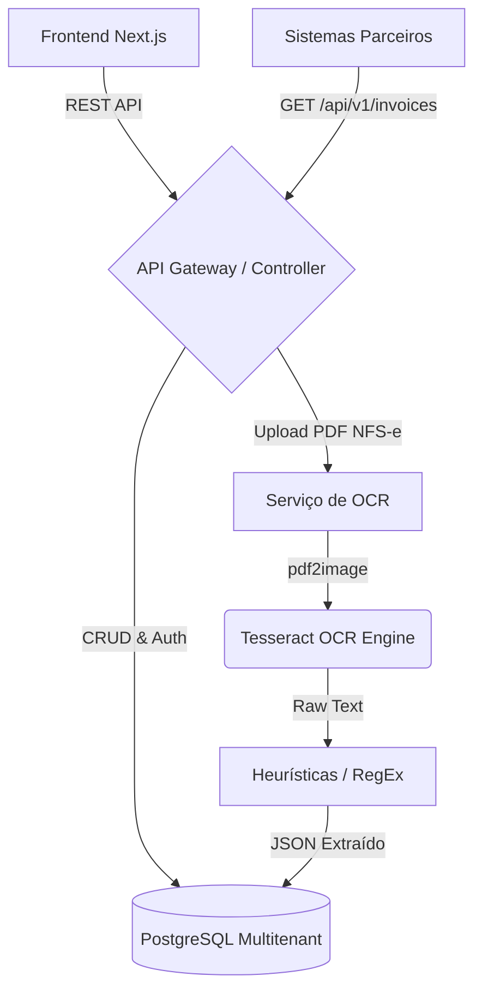

# NFSe SaaS Platform (OCR & Multitenant Edition)

Este repositório contém o código-fonte de uma plataforma SaaS desenvolvida para a captura automatizada, armazenamento, gestão e integração de documentos fiscais eletrônicos (NF-e, NFS-e e CT-e), com foco central na leitura estruturada de PDFs via OCR.

## 1. Visão Geral

O **NFSe SaaS Platform** atua como um sistema centralizador e gerenciador de notas fiscais emitidas contra CNPJs cadastrados no sistema, operando em um ecossistema multitenant.

### Objetivos do Projeto
1. **Captura Automatizada:** Integração com prefeituras e SEFAZ para coleta de notas fiscais.
2. **Leitura OCR (Optical Character Recognition):** Extração de dados cruciais (CNPJ, Valor, etc.) de PDFs de notas fiscais de serviço (NFS-e) de prefeituras sem webservice aberto.
3. **Arquitetura Multitenant (SaaS):** Isolamento total de dados entre diferentes empresas/clientes no mesmo banco de dados.
4. **Integração ERP:** API RESTful robusta para alimentação de sistemas contábeis parceiros.

## 2. Ciclo de Desenvolvimento (Fases)

1. **Fase 1 (Python First):** Validação da arquitetura multitenant e da extração OCR complexa utilizando o ecossistema Python (FastAPI + Pytesseract).
2. **Fase 2 (Portabilidade Java):** Reconstrução exata do contrato de API utilizando Java 21 e Spring Boot, comprovando proficiência técnica em múltiplas linguagens corporativas.

## 3. Tecnologias e Ferramentas (Stack)

* **Frontend (Next.js 14 / React):** Interface de usuário com painel de controle SaaS, utilizando TypeScript e Tailwind CSS.
* **Backend A (Python 3.12 / FastAPI):** Construção rápida e ideal para integração com bibliotecas nativas de Inteligência Artificial e OCR.
* **Backend B (Java 21 / Spring Boot 3):** Reconstrução do backend para alta escalabilidade e tipagem forte em ambiente enterprise.
* **Módulo OCR:** Tesseract (Pytesseract / Tesseract4J) e `pdf2image`.
* **Banco de Dados:** PostgreSQL via SQLAlchemy (Python) e Hibernate (Java).

## 4. Estrutura do Projeto

```text
NFSe/
├── frontend/             # Aplicação Next.js (Dashboard e Painel SaaS)
│   ├── app/              # Rotas da aplicação web
│   └── components/       # Componentes React reutilizáveis
├── backend-python/       # API Core e Worker de OCR em Python
│   ├── app/              # Lógica de negócio, Rotas e Modelos (FastAPI)
│   └── requirements.txt  # Dependências Python
└── backend-java/         # (Fase 2) API Core em Java Spring Boot
```

## 5. Arquitetura do Backend



## 6. Execução

### Pré-requisitos
* **Node.js (>= 20)**
* **Python (>= 3.12)** ou **Java (>= 21)**
* **Tesseract OCR** instalado no Sistema Operacional e no PATH.
* **PostgreSQL** ou **SQLite** (para ambiente de desenvolvimento local).

### Passo a Passo

1. **Frontend (Next.js):**
    ```bash
    cd frontend
    npm install
    npm run dev
    ```
2. **Backend (Python):** 
    ```bash
    cd backend-python
    python -m venv venv
    venv\Scripts\activate # Windows
    pip install -r requirements.txt
    uvicorn app.main:app --reload
    ```

## 7. Funcionalidades Administrativas
- **Painel Multitenant:** Cadastro de empresas e isolamento de acessos.
- **Upload de Notas:** Envio manual de NFS-e (PDF) e acompanhamento em tempo real da extração via OCR.
- **Auditoria:** Rastreabilidade e logs de ações dos usuários dentro da plataforma.

## 8. Motivação e Escolhas Arquiteturais (Trade-offs)

* **Solução OCR Open-Source vs Nuvem Comercial:** A escolha pelo **Tesseract** no lugar de ferramentas como AWS Textract se deu pela decisão de custo zero operacional e pelo desafio técnico de implementar heurísticas e RegEx capazes de lidar com a enorme heterogeneidade dos layouts de notas fiscais municipais do Brasil.
* **FastAPI Inicial vs Spring Boot:** A escolha de começar o projeto com **FastAPI (Python)** deve-se à imbatível sinergia da linguagem com bibliotecas de visão computacional e OCR (como `pytesseract` e OpenCV). O porte posterior para **Spring Boot** demonstra o domínio sobre a transição de um ecossistema rápido de prototipagem para um ecossistema maduro enterprise.

## 9. Desafios Enfrentados e Soluções

* **Extração de Dados em Layouts Variados de NFS-e:**
  * *Desafio:* Cada prefeitura do Brasil formata sua NFS-e de maneira diferente.
  * *Solução:* Abordagem baseada na transformação do PDF em imagem (`pdf2image`) para evitar bloqueios de cópia, seguida pela extração integral do texto, combinada com "Regex Matching" focado em termos chave universais ("CNPJ Tomador", "Valor Total", "ISS").
* **SaaS Multitenancy em Aplicações Duplas:**
  * *Desafio:* O isolamento dos dados de diferentes empresas no mesmo banco usando dois frameworks distintos (SQLAlchemy e Hibernate).
  * *Solução:* Adoção de uma coluna `tenant_id` padronizada em nível de banco de dados, protegendo o acesso diretamente nas camadas de repositório de ambos os backends através do contexto do Token JWT.
